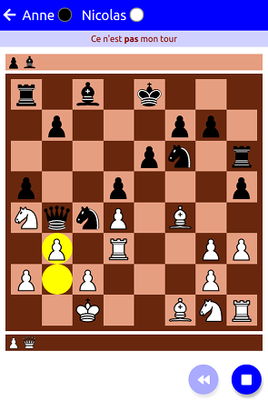
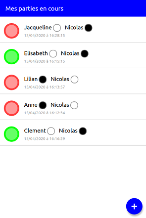
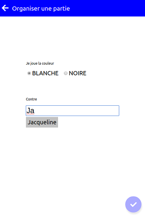

# boardgames-frontend

This is the frontend for my social boardgame engine, currently only implementing chess. This is also an example of React project using context to store/share data instead of redux !

This project was bootstrapped with [Create React App](https://github.com/facebook/create-react-app).

## Screenshots

| The chessboard        | The session list           | Adding a new session  |
|:-------------:|:-------------:|:-----:|
|  |  |  |

## The author

This project has been developed by Nicolas Enzweiler.

E-Mail address: [nicolas.enzweiler@gmail.com](mailto:nicolas.enzweiler@gmail.com)

Github : [https://github.com/ezwn](https://github.com/ezwn)
